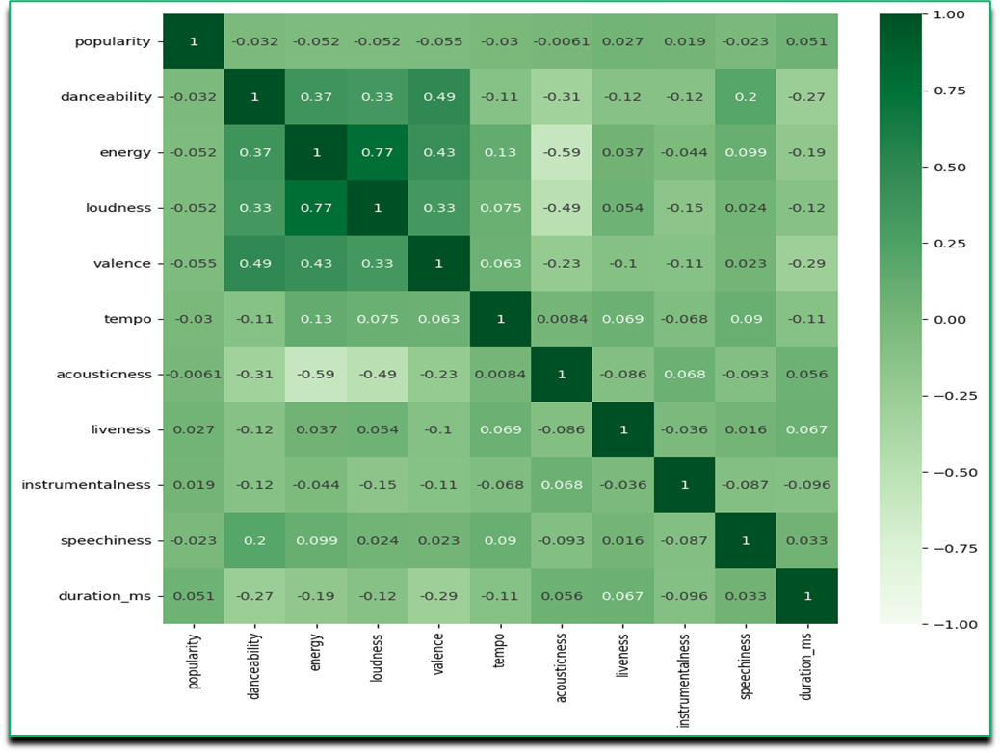
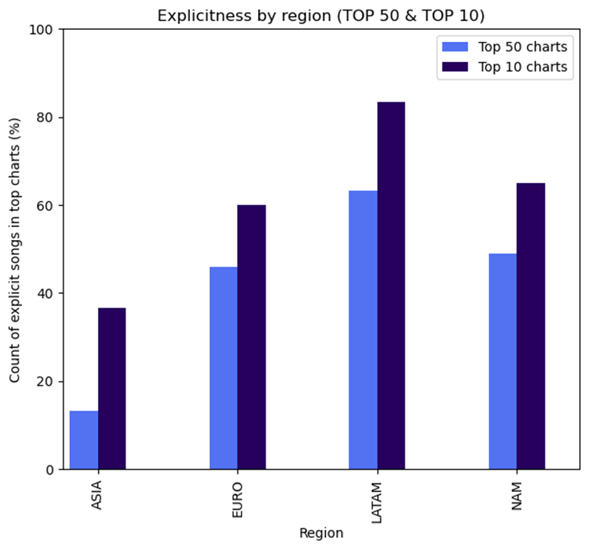
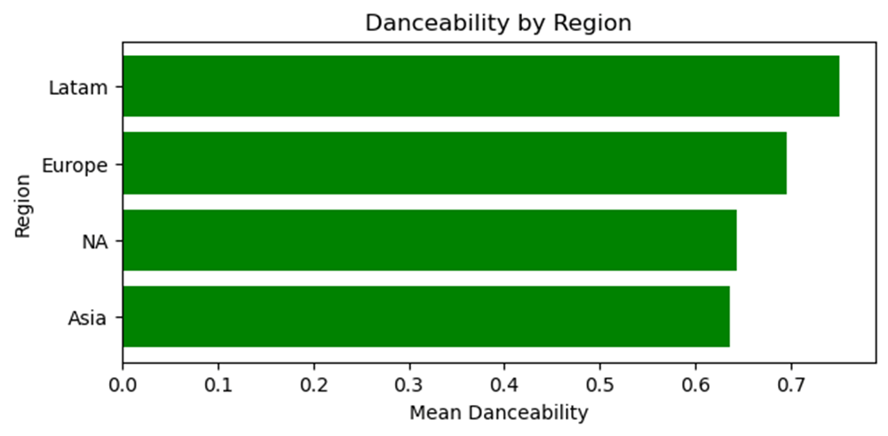
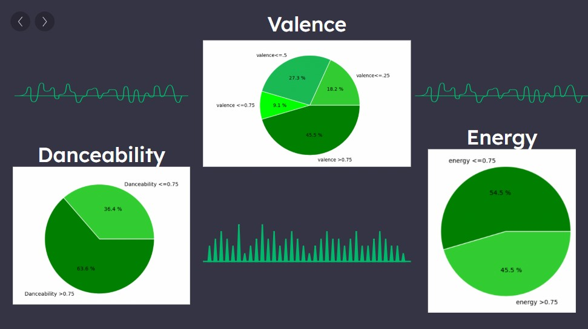
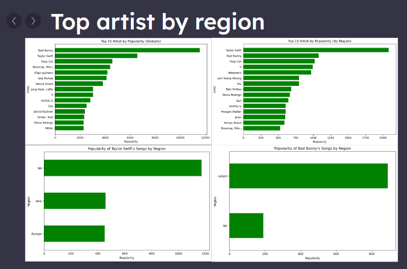

# Proyect1 Spotify Analysis 

BOOTCAMP TEC DATA ANALYSIS

Students:David Lara, Ivan Chavez, Rene Mondragon, Miguel Vargas.

#CONTEXT

The original dataset was obteined from kagel and tracked the top 50 per country per day for the month of october.

You can review the dataset use to this project here https://www.kaggle.com/datasets/asaniczka/top-spotify-songs-in-73-countries-daily-updated

¿Why the spotify dataset?

- Provided several metrics to analyze

- Explore cultural differences

- Recent data and verifed

Top 50 songs from 73 countries, all displayed over 6 days. It mentiened attributed of each songes based on the:

- Danceability:Based on various elements returns the suitability of the song for dancing (0-1)

- Energy: Measure of intensity and activity (0-1)

- Popularity: Algorithm that measures the growing listener base for a song (0-100)

- Valance:Likelihood of a song to make the listener happy (0-1)

- Tempo:Estimated tempo in beats per minute of a given track (BPM)

- Liveness:Detects the presence of  live audience in the recording (0-1)

#OBJECTIVE 

Our main goal is to explore regional differences and variable correlation.Explore cultural differences by region, taking popularity and ranking as the standard for our analysis and find interesting correlations between metrics.

#INQUIRIES:

  - Correlation with popularity:
  Is there a variable that influences popularity heavily?
  
  - Explicitness and popularity:
  Which are the regions that listen more heavily themed music.
  
  - Danceability and region:
  Which are the regions that prefer highly danceable songs.
  
  - Top 1 analysis:
  Are there common attributes amongst the top 1 song in each country?

  - Top artist by region:
  Based on popularity (not rank) which is the most popular artist

We decided to concentrate only on one day because we wanted to see the relationship between the songs depending on their attributes and not their movement in the top. This allowed us to create the "hypothesis" that if there is an attribute that influences a song to be in the top or not.

Countries selection by region:

Asia: Republic of Korea, Taiwan, Singapore

North America: USA, Canada

Europe: France, United Kindom, Romania

Latin America: Mexico, Colombia, Chile

# Conclusions:

## Is there a variable that influences popularity heavily? ##
  
We have not see any KPI that has a strong relation vs popularity, how ever doing this excercise we can see that between KPIs we have some moderate and strong relations. For this part we use the pearson coefficient.

-Energy vs Loudness.

-Danceability vs Valance

-Energy vs Valance

-Loudness vs  Danceability

We can see the relations on the image below.

## Which are the regions that listen more heavily themed music? ##

We have some findings here with the Explicitness se image below

Latam Region 83% of the top 10 are explicit.

Nort America 49% of the top 10 are explcicit

Europe       46 % of the Top 10 are epxlicit.

Asia         36% of the top 10 are explicit

## Which are the regions that prefer highly danceable songs? ##

In the topic of danceability we have found that the Region that likes most danceables songs is Latam followed by Europe.

  
## Are there common attributes amongst the top 1 song in each country? ##

We have found some attributes that the Top 1 songs have in common such as:

Valance

Danceability 

Energy

## Based on popularity (not rank) which is the most popular artist? ##

Based on the Popularity of the song the most popular artits Globally it seems to be Bad Bunny followed by Taylor Swift

  
